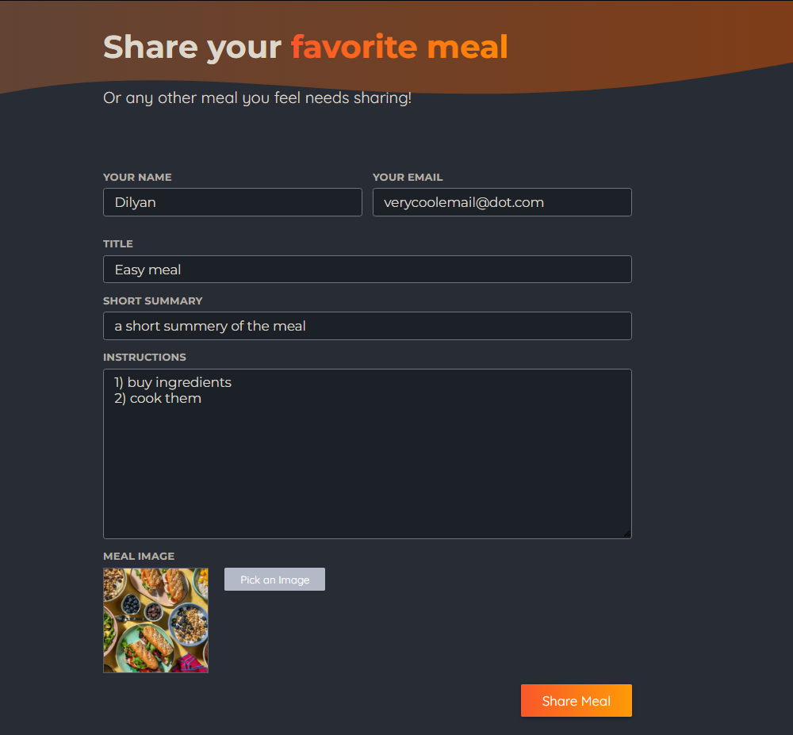
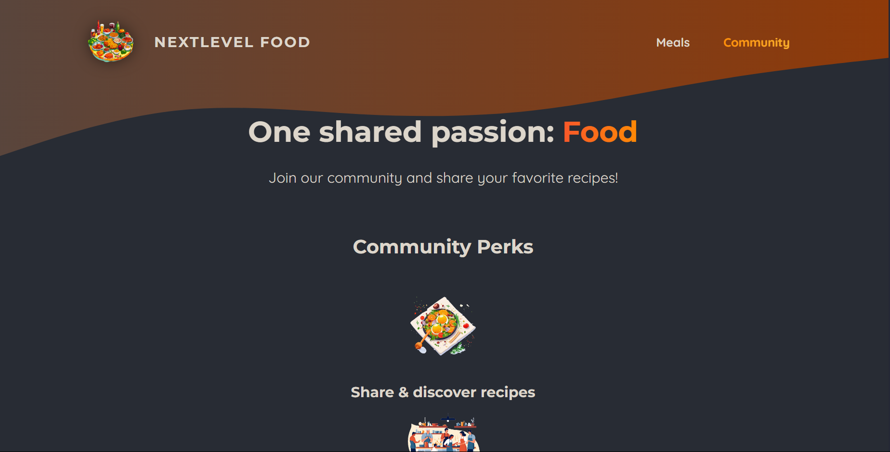

<p align="center">
  
</p>

---

# 🍔 NextLevel Food – Next.js Course Project

A web application built with **Next.js (App Router)** that allows users to explore, view, and share meals.
This project was developed as part of Next.js course, focusing on modern features such as **file-based routing, server components, dynamic routing, loading states, server actions, and form handling**.

---

## 📖 Features

* **Homepage** – Hero section introducing the platform.
* **Meals Page** – Browse a collection of meals created by the community.
* **Meal Details Page** – View full recipe details for each meal (dynamic routing).
* **Share Meal Page** – Submit a new recipe via a form (with image upload).
* **Loading & Error States** – Custom loading spinners and error pages.
* **Server Components & Actions** – Data fetching and form submission handled on the server.

---

## 🎯 What I Learned

**With this course**, I gained a strong foundation in Next.js with a focus on the **App Router**:

* **File System Routing** – Using `page.js`, `layout.js`, `error.js`, and `not-found.js`.
* **Loading States** – Handling async data and UI feedback with suspense and loading components.
* **Dynamic Routing** – Creating routes with `[mealSlug]` for individual meals.
* **Server Components** – Learned that components run on the server by default, and how to use `use client` when needed.
* **Server Actions** – Async functions for form submissions and updating UI directly.
* **useFormStatus Hook** – Tracking form submission states to improve UX.
* **Caching & revalidatePath** – Ensuring fresh data in production.
* **Metadata** – Adding static and dynamic metadata for SEO.

This project helped me connect theory with practice and now I feel more confident building real-world apps with Next.js.

---

### Homepage


### Meals Page


### Share a Meal



### Community Page



---

## 🚀 Getting Started

1. Clone the repository:

   ```bash
   git clone https://github.com/Dilyannn/Next.js-course.git
   cd nextlevel-food
   ```

2. Install dependencies:

   ```bash
   npm install
   ```

3. Run the development server:

   ```bash
   npm run dev
   ```

4. Open [http://localhost:3000](http://localhost:3000) to view it in the browser.

5. You can also experience the finished version if you run
   
   ```bash
   npm run build
   npm start
   ```
   And then again open http://localhost:3000 to view it in the browser
